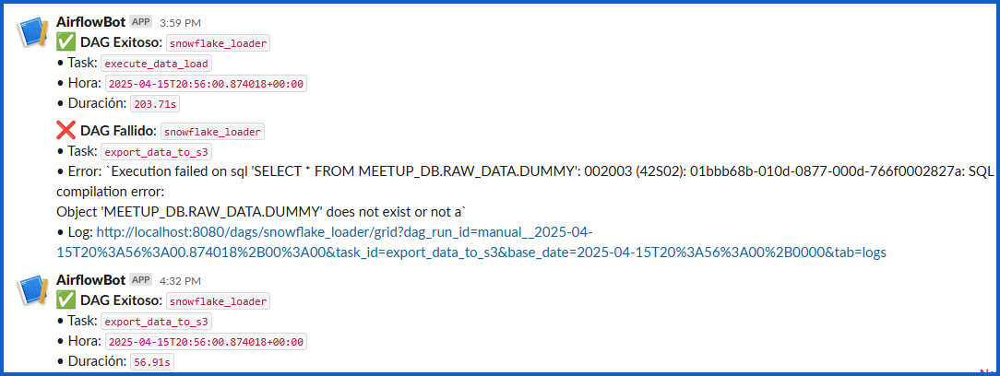

# Proyecto: Snowflake Data Pipeline with Airflow & S3

## Este proyecto implementa un pipeline de datos con:

- Apache Airflow
- Snowflake
- Amazon S3
- Kaggle
- Slack Webhooks


## ✅ Flujo de trabajo
- Descarga dataset desde Kaggle.
- Carga los CSV en Snowflake (RAW_DATA).
- Crea nuevas tablas en TRANSFORM_DATA usando SQL.
- Ejecuta consultas y exporta resultados a S3.
- Envía notificaciones a Slack al finalizar cada tarea.


```
├── dags/
│   ├── load_process.py              # DAG principal
│   └── utils/
│       ├── callbacks.py             # Slack alerts
│       ├── snowflake_conn.py        # Conexión a Snowflake
│       ├── s3_conn.py               # Conexión a S3
│       └── task_executor.py         # Ejecuta funciones con logging
│
├── scripts/
│   ├── load_dataset_snowflake.py    # Carga de datos a Snowflake
│   └── export_to_s3.py              # Exporta resultado a S3
│
├── include/
│   └── sql/
│       ├── create_tables.sql        # SQL para crear tablas
│       └── export_queries.sql       # SQL para hacer selects
```


## ⚙️ Requisitos
- Python 3.8+
- Airflow 2.x
- Cuenta de Snowflake
- Cuenta de AWS (S3)
- Cuenta de Kaggle + API Key

### Guardar tu archivo kaggle.json en:
- project-root/.secrets/kaggle.json


### 🔔 Notificaciones
**Slack envía alertas en:**

- ✅ Éxito
- ❌ Error

**No olvide crear una Slack Webhook URL para poder enviar mensajes desde Airflow a un canal:**

- 1. Ingrese a https://api.slack.com/apps
- 2. Clic en Create App
- 3. Activá la opción que indica "Activate Incoming Webhooks"
- 4. Clic en "Add New Webhook to Workspace" y continue con los demas pasos.




# 📄 Licencia
- MIT — libre de usar y adaptar.


# 👨‍💻 Autor
Luiyerfreht Villamil\
Data Engineer | Python | Cloud\
GitHub